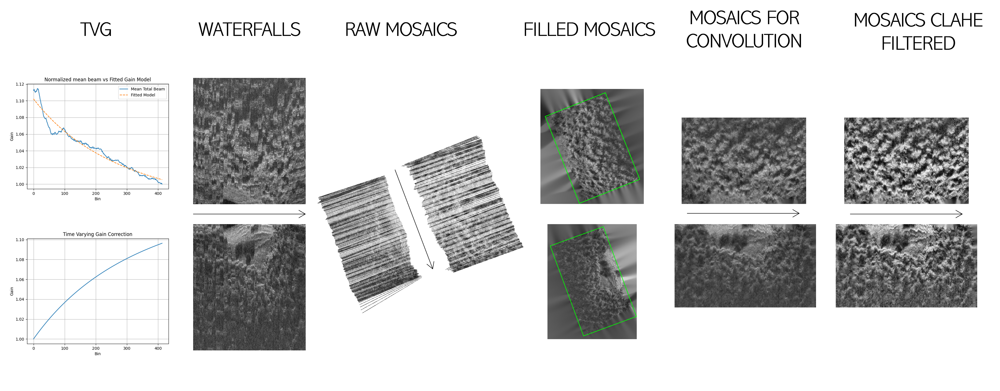

# Side-Scan-Sonar Image Processing Pipeline

A Python package for processing and visualizing side-scan sonar data, starting from mission logs and raw sensor outputs.

## Input Data

The input data must be a `.csv` file structured like the [demo_navstatus_and_sss.csv](resources/demo_navstatus_and_sss.csv) file in the `resources/` directory.

### Notes:
- Column names must match those in the demo file, as the program uses them to identify specific quantities.
- The file may contain unnecessary columns (e.g., `"time"`, `"ll_origin"`), which will be ignored.
- **Important**: Array-like entries (such as `"sss_left_beam"` and `"sss_right_beam"`) must be formatted as stringified Python lists, e.g., `"[101, 99, 112, ...]"`.

---

## Outputs



Several types of outputs are generated during the pipeline execution:

- **Time-Varying Gain (TVG)**:  
  A quadratic hyperbolic model is fit to the intensity values of the average beam and used to compute a TVG curve that compensates for energy loss over distance. The resulting plots are saved in the folder specified by `output_tvg_folder` in `config.yaml`.

- **Waterfall Images**:  
  Images are created by cropping out nadir and far-field zones, then stacking beams sequentially. Saved to `output_waterfall_folder`.

- **Localized Measures**:  
  `.csv` files associating sonar bins with their corresponding NED coordinates. These files are stored in `output_localized_measures_folder` to avoid recomputation, as this step is time-consuming.

- **Raw Mosaics**:  
  Geo-referenced sonar mosaics where pixels not covered by sonar data are set to transparent. These are oriented so that the vertical axis points north. Saved in `output_raw_mosaics_folder`.

- **Filled Mosaics**:  
  Raw mosaics are inpainted using OpenCV’s `cv2.inpaint` to fill missing regions. A bounding rectangle enclosing the sonar-covered area is also drawn. Saved in `output_filled_rect_mosaics_folder`.

- **Clean Mosaics for Convolution**:  
  Filled mosaics are rotated and cropped to produce square, convolution-ready images. These are stored in `output_clean_mosaics_folder`.


## Requirements

- Python >= 3.7
- numpy
- pandas
- opencv-python
- matplotlib
- tqdm
- scipy
- PyYAML

Install dependencies using:

```bash
pip install -r requirements.txt
```

## Installation

Clone the repository and install in editable mode

```bash
git clone https://github.com/GabrieleScarpelli/sss_pipeline.git
cd sss_pipeline
pip install -e .
```

## Usage

Edit the config.yaml file according to your needs and run the command

```bash
run-sss-pipeline --config demo_config.yaml
```
Make sure your main.py has a main() function that parses command-line args.

## Folder Structure

<pre>
sss_pipeline/
├── side_scan_sonar_pipeline/
│   ├── __init__.py
│   ├── io.py
│   ├── pipeline.py
│   └── processing.py
├── config.yaml
├── main.py
├── requirements.txt
├── setup.py
└── .gitignore
</pre>
